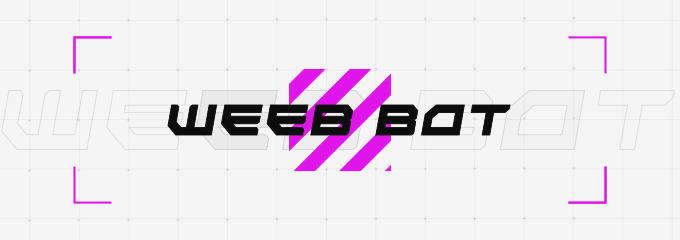

# weeb-bot
  

A Free and Open-Source Discord Bot with Premium and Advanced Features with a local dashboard

## About

This is a bot I started purely for fun. The bot is fully coded in python with an added dashboard coded in Discord Flask. If you have any features or any bugs check the issue template. More features will be added soon! Check the roadmap on what I'm planning to add.

## Requirements

- Python 3.11 or higher
- Lavalink 4 (**You can use a server instead of using a local server, But make sure the server has LavaSrc for Spotify Support.**)

## Setup

1. Create a `.env` file and refer to the `.env.example` for all environment variables
2. Install all dependancies using `pip install -r requirements.txt` or `pip3 install -r requirements.txt`
3. Once installed all the dependancies run `python main.py` or `python3 main.py`

## Roadmap

More features will be added into the roadmap once the ideas start flowing in. (Yes I know very ambitious)

- [ ] Leveling System
  - [ ] Basic XP system
- [ ] Moderation
  - [ ] Typical Moderation Commands (ban, kick, timeout etc...) *
  - [ ] Jail
  - [ ] FakePerms *
  - [ ] Other things I will think about
- [ ] Games *
  - [x] Counter
  - [x] Dice Roll
  - [ ] Mock Black Jack
- [ ] Economy
  - [ ] Daily, Weekly, Monthly Claims
  - [ ] Bank Accounts
  - [ ] Gambling 🎰
  - [ ] Begging
- [ ] Music *
  - [ ] Lyrics
  - [x] Spotify Support
  - [ ] Interactive UI **
- [ ] Statistics on some games **
  - [ ] Valorant (limited to only player stats)
  - [ ] Hypixel
    - [ ] Bedwars Stats
    - [ ] Skywars Stats
    - [ ] Skyblock Stats
  - [ ] osu
- [ ] Anime Searcher **
- [ ] Utilites
  - [ ] Giveaway system
  - [ ] Ticket System

(*) In progress

(**) Can be removed

## License

All code is provided under the MIT License. You are fully responsible for any changes, usage, and/or edits made to the code. I assume no liability for any consequesnces resulting from its use.
